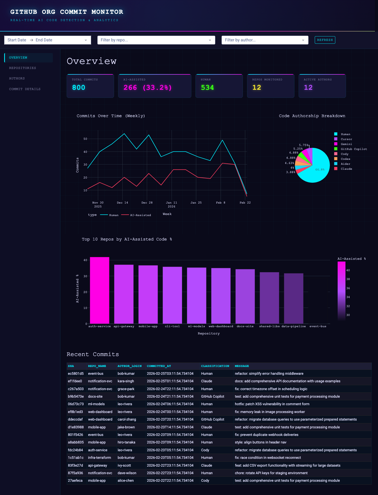
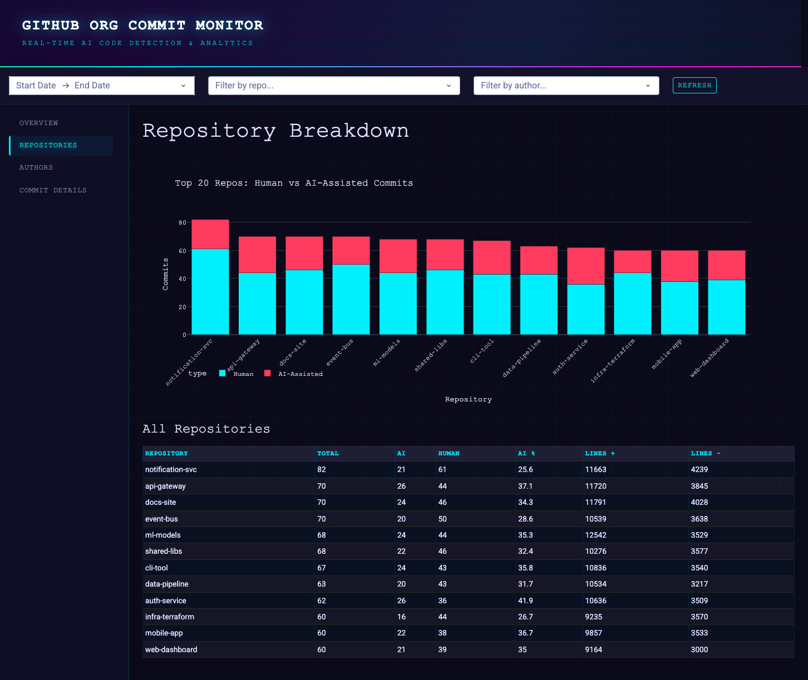
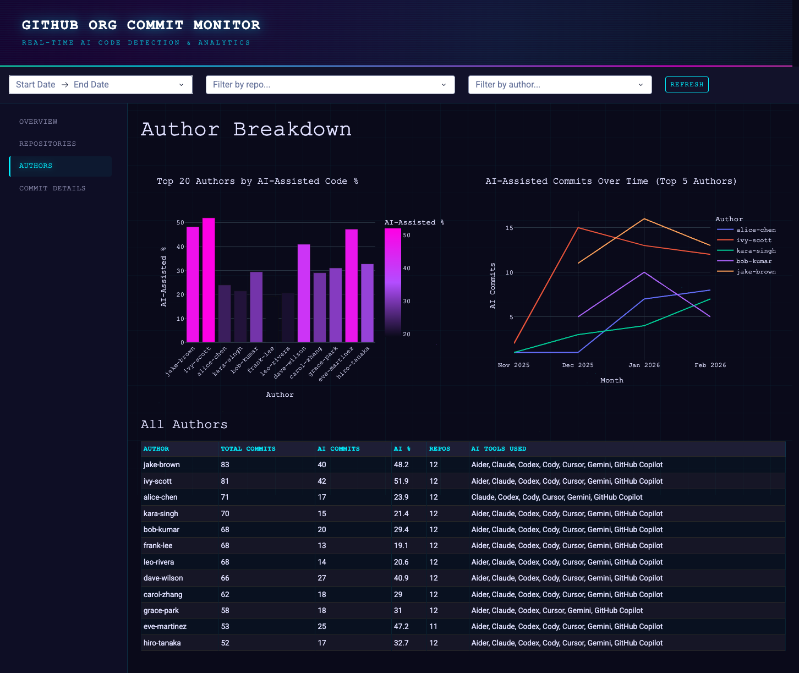
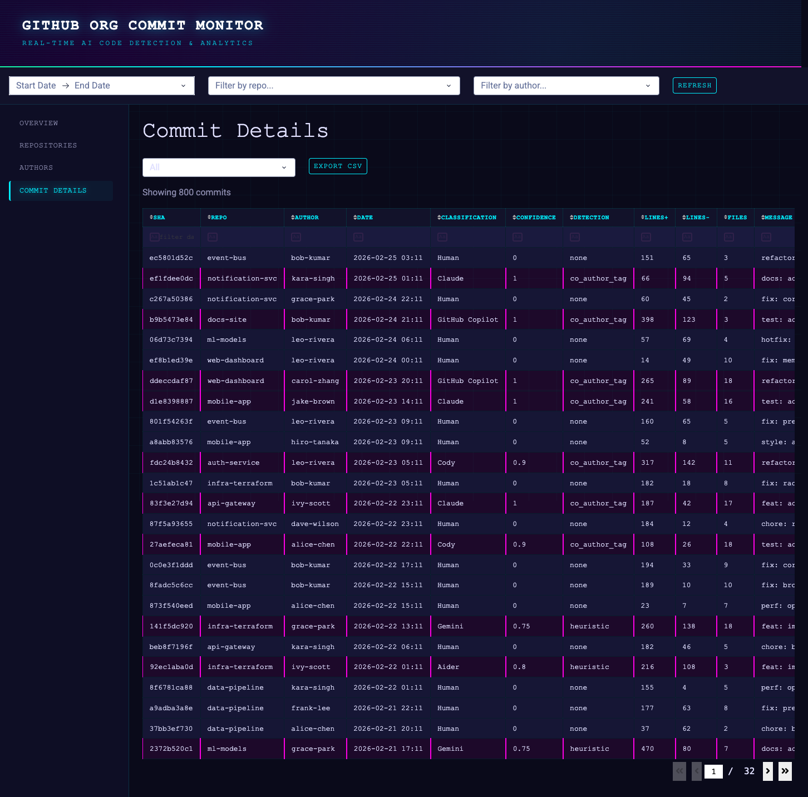

# GitHub Org Commit Monitor

A dashboard that monitors commits across a GitHub organization's repositories to detect and visualize AI-assisted code contributions. It distinguishes between human and AI-generated commits, categorizes the AI tools used, and provides interactive analytics.

## Features

- **Commit Collection** — Fetches all commits across an org's repos with pagination, ETag-based conditional requests, and rate-limit handling
- **AI Detection** — Identifies AI-assisted commits via co-author tags (100% confidence) and heuristic pattern analysis (message style, docstrings, type annotations, etc.)
- **Supported AI Tools** — Claude, GitHub Copilot, Cursor, Cody, Aider, Devin, Gemini, Windsurf, Codex, OpenAI
- **Interactive Dashboard** — Four pages: Overview KPIs, Repository breakdown, Author statistics, and a searchable Commit Details table with CSV export
- **Background Polling** — Scheduled sync at configurable intervals using APScheduler
- **Historical Backfill** — Backfill commits from a specific date

## Tech Stack

| Layer | Technology |
|-------|------------|
| Backend | Python, SQLite (WAL mode), PyGithub, httpx |
| Dashboard | Dash, Plotly, Pandas, Dash Bootstrap Components |
| Scheduling | APScheduler |

## Project Structure

```
├── run.py                    # CLI entry point (collect, dashboard, serve, backfill)
├── requirements.txt
├── .env.example
├── data/
│   └── commits.db            # SQLite database (auto-created)
└── src/
    ├── config.py             # Configuration management
    ├── database.py           # Schema & database operations
    ├── collector/
    │   ├── github_client.py  # GitHub API wrapper with rate limiting
    │   ├── commit_fetcher.py # Commit collection logic
    │   └── scheduler.py      # Background polling scheduler
    ├── analyzer/
    │   ├── tag_detector.py   # AI co-author tag detection
    │   └── heuristic.py      # Heuristic pattern analysis
    └── dashboard/
        ├── app.py            # Main Dash app with routing
        ├── theme.py          # Shared colors, names & dark layout helper
        ├── assets/
        │   ├── 00-cyberpunk-theme.css   # Core dark theme & neon styles
        │   ├── 01-hero-banner.css       # Animated gradient banner
        │   ├── 02-background-animation.css  # Floating particles & grid
        │   └── 10-counter-animation.js  # KPI counter animations
        └── pages/
            ├── home.py       # Overview: KPI cards, trend & pie charts
            ├── repos.py      # Repository breakdown
            ├── authors.py    # Author statistics & AI adoption
            └── details.py    # Searchable commit table + CSV export
```

## Getting Started

### Prerequisites

- Python 3.9+
- A [GitHub Personal Access Token](https://github.com/settings/tokens) with `repo` scope

### Installation

```bash
git clone https://github.com/your-username/gh-org-commit-monitor.git
cd gh-org-commit-monitor
pip install -r requirements.txt
```

### Configuration

Copy the example env file and fill in your values:

```bash
cp .env.example .env
```

| Variable | Default | Description |
|----------|---------|-------------|
| `GITHUB_TOKEN` | *required* | GitHub Personal Access Token |
| `GITHUB_ORG` | *required* | GitHub organization to monitor |
| `POLL_INTERVAL_MINUTES` | `30` | Background sync frequency |
| `DB_PATH` | `data/commits.db` | SQLite database path |
| `DASHBOARD_PORT` | `8050` | Dashboard port |
| `DASHBOARD_HOST` | `0.0.0.0` | Dashboard bind address |
| `BACKFILL_DAYS` | `90` | Default historical lookback |

### Usage

```bash
# One-time sync of all repositories
python run.py collect

# Start the dashboard (no background polling)
python run.py dashboard

# Run both background polling and dashboard
python run.py serve

# Backfill commits from a specific date
python run.py backfill --since 2025-01-01
```

The dashboard will be available at `http://localhost:8050`.

## Dashboard Preview

Dark cyberpunk theme with neon accents, animated KPI counters, floating particle backgrounds, and an animated gradient hero banner.

### Overview — KPIs, trend charts, pie chart, top repos bar chart, recent commits table



### Repositories — Stacked bar chart (Human vs AI) and per-repo statistics table



### Authors — AI usage per author, adoption trends over time, tools breakdown



### Commit Details — Searchable/sortable table with classification filter and CSV export



### Visual Effects

| Effect | Description |
|--------|-------------|
| Hero banner | Animated gradient cycling through dark purple/blue/green with scanline overlay |
| Neon border | 2px line below banner cycling cyan → magenta → green |
| Particles | 20 floating dots (cyan, magenta, green, purple) rising slowly |
| Grid | Subtle 50px cyan grid lines behind all content |
| KPI counters | Numbers animate from 0 to target with easeOutCubic easing |
| Card hover | Cards lift 4px, scale 1.02x, and gain a cyan glow on hover |
| Sidebar | Active link gets a cyan left border + text glow |
| Scrollbar | Custom dark scrollbar with cyan thumb |

## How It Works

```
GitHub Organization
  → GitHub API (with rate limiting & ETags)
    → Commit Fetcher (repos & commits)
      → Tag Detector (co-author tags → 100% confidence)
      → Heuristic Analyzer (patterns → scored confidence)
        → SQLite Database (upsert with classification)
          → Dash Dashboard (read & visualize)
```

**Detection methods:**

1. **Co-author tags** — Scans commit messages for `Co-Authored-By` lines matching known AI tools. Yields 100% confidence.
2. **Heuristic analysis** — When no tag is found, analyzes commit message style and diff content for patterns like conventional commit format, comprehensive docstrings, dense comments, and type annotations. Produces a weighted confidence score.

## License

MIT
